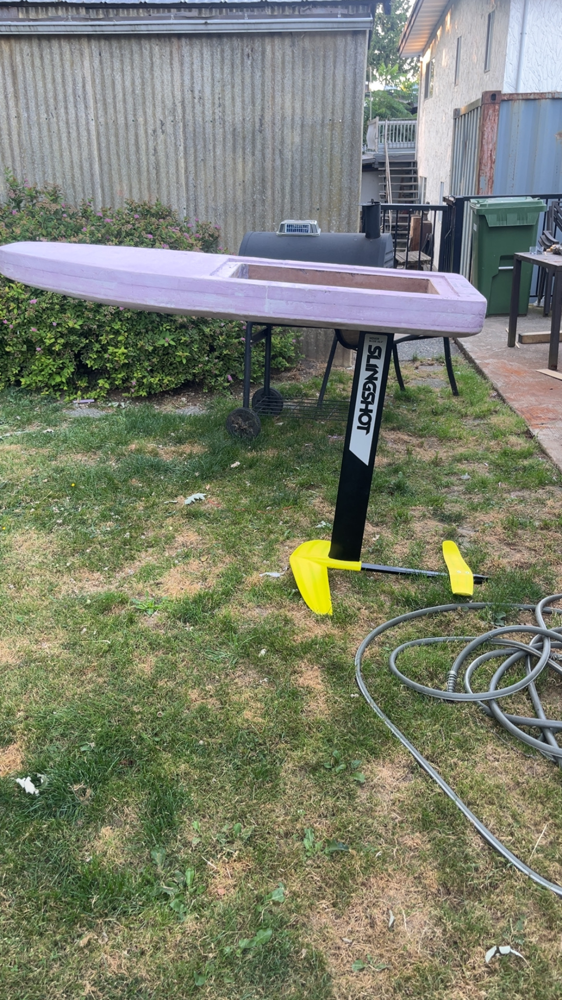
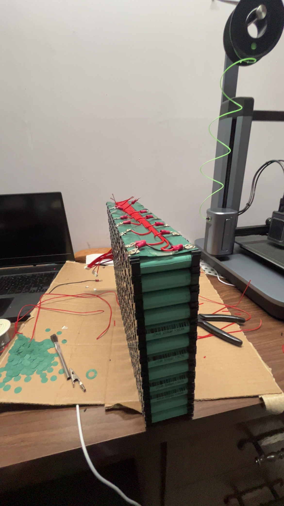

<h1 align="center">Hey, I’m ChrisJan </h1>

  Mechanical Engineering @ UVic • Currently Testing E-foil Build • CAD & prototyping

  <a href="mailto:chrisjandaling@gmail.com">📧 Email</a> •
  <a href="https://www.linkedin.com/in/chrisjandaling">🔗 LinkedIn</a> •
  <a href="#-featured-project-e-foil-build">🛠️ E-foil Project</a>
  

---

## 🧭 About me
- 🎓 Mechanical Engineering student at UVic (co-op track)
- 🛠️ I love building things end-to-end: CAD → fabrication → electronics → testing
- 🌊 Current project: Testing/finalising and riding an electric hydrofoil (e-foil)
- 🧪 Interests: Mechanical design, electronics, composites, battery packs and simulation

---

## 🧰 Toolbox
**CAD:** SolidWorks, FreeCAD  
**Fabrication:** 3D printing (PLA/PETG/TPU), basic CNC, composites (fiberglass/carbon)  
**Electronics:** Li-ion packs (spot-welding, soldering, wiring), ESCs, waterproofing.  
**Software:** C/C++, MATLAB, Python basics, Git/GitHub  
**Other:** Project scoping, cost breakdowns, test plans, documentation

---

## 🚀 What I’m working on
- Final Testing on efoil project    
- Cleaning up and optimizing CAD models to be able to release easily printable variants for community use

---

## 📌 Featured project: E-foil build

- **Overview:** Custom board, 16S Li-ion pack, waterproof inrunner motor, high-current ESC  
- **Highlights:**  
  - 16S battery architecture with BMS following industry standard practices.  
  - Composite board (multi-layer fiberglass) with integrated hatches  
  - Motor pod + mast clamp, designed for sealing & serviceability  
- **Repo:**  https://github.com/ChrisJanDaling/ChrisJanDaling/blob/main/_projects/Efoil/efoil.md 
- **Docs quick links:**  
  - [`/docs/BOM.md` – Bill of Materials](https://github.com/ChrisJanDaling/ChrisJanDaling/blob/main/_projects/Efoil/efoil.md#cost--bill-of-materials-bom)  
  - `/cad/` – SolidWorks & STEP exports  (Final Files to e uploaded soon)
  - [`/analysis/` – Power, range & buoyancy calcs](https://github.com/ChrisJanDaling/ChrisJanDaling/blob/main/_projects/Efoil/efoil.md#requirements--key-calculations-approx-based-on-supplier-specs)

---

## 📷 Gallery 

  
  
  

---

## 📝 Recent learning notes
- Optimizing CAD for 3D printing (DfAM): Parametric, master-sketch parts with print-aware geometry (min walls/features, self-supporting angles), smart part       orientation, split/keys for large builds, ribs/bosses and heat-set insert seats, printable fits/tolerances, quick clearance checks, and light FEA on thin walls to  trim weight while keeping stiffness.  
- Battery pack current distribution and thermal considerations

---

## 📫 Contact
- **Email:** <chrisjandaling@gmail.com>  
- **LinkedIn:** [linkedin.com/in/chrisjandaling](https://www.linkedin.com/in/chrisjandaling)

---

<!--
**ChrisJanDaling/ChrisJanDaling** is a ✨ _special_ ✨ repository because its `README.md` (this file) appears on your GitHub profile.

Here are some ideas to get you started:

- 🔭 I’m currently working on ...
- 🌱 I’m currently learning ...
- 👯 I’m looking to collaborate on ...
- 🤔 I’m looking for help with ...
- 💬 Ask me about ...
- 📫 How to reach me: ...
- 😄 Pronouns: ...
- ⚡ Fun fact: ...
-->
